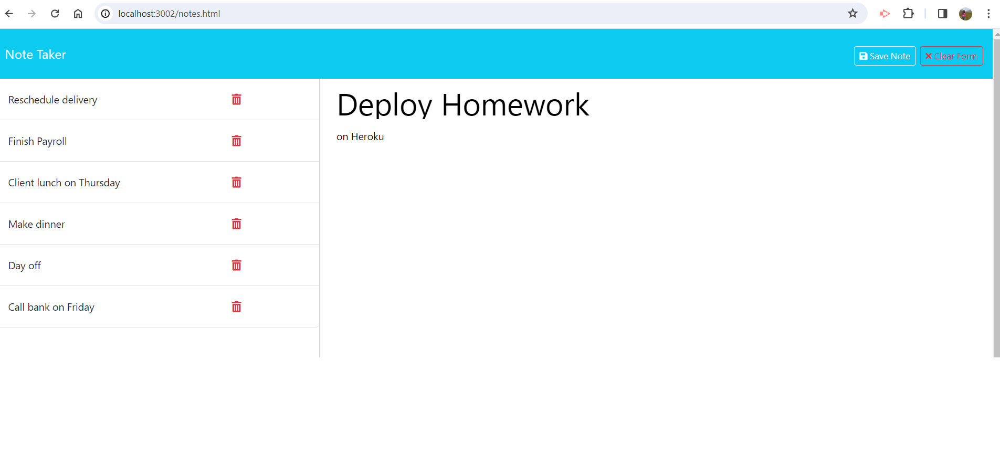
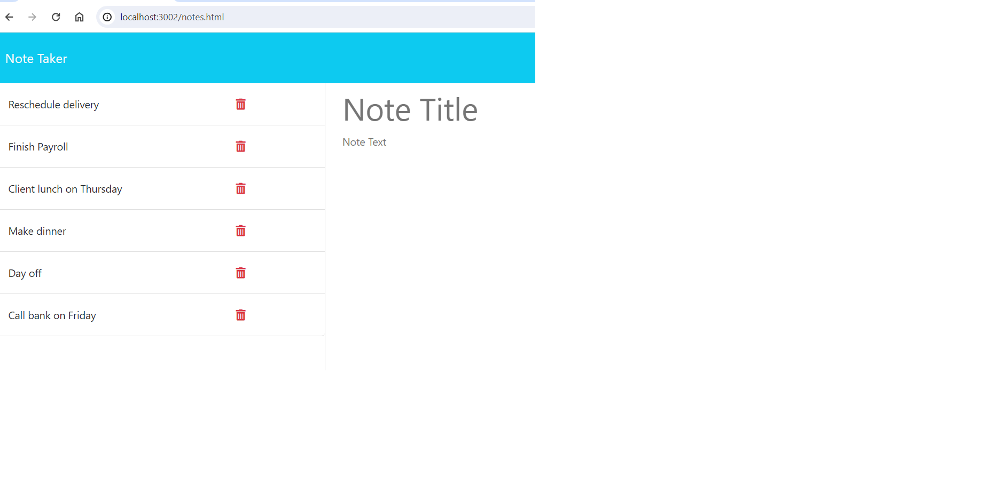

# express-note-taker# 11 Express.js: Note Taker

## Description
The Module 11 Challenge objective was to create an application called Note Taker that can be used to write and save notes. This application will use an Express.js back end and will save and retrieve note data from a JSON file.

When the user opens Nate Taker, they are presented with a landing page with a link to a notes page. After clicking the link, the user is presented with a page containing a column on the left and the right. The left is for the notes already taken and the right is for taking new notes.

After typing in the information the user would like to store in the note they can then save the note by pressing the save button. 

The list on the left continues to grow as the user makes new notes. The user can click on any note in the left column to populate that note in the right column for editing or viewing purposes.

User can delete notes from the list by clicking on bin icon to delete notes from the right column for editing or viewing purposes. That note will delete from the "db.json" as well.

Made this backend note taker using the express.js module, npm install express, npm init -y for packages.json.

